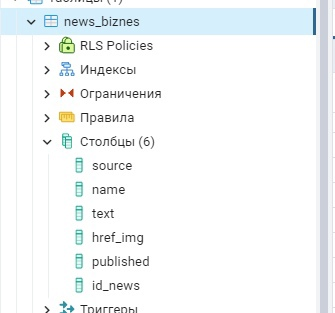

<h1 align="center">Рады представить Вам решение команды Gecko!</h1>
<h2>Задача: Профильная лента бизнес-новостей для клиентов Банка ВТБ</h2>
<hr>
<h2>Для начала работы:</h2>
<h3>Необходимое ПО:</h3>
<p>На устройстве, на котором будет развернуто решение, необходимо установить следующие программы:</p>
<ul>
  <li>PostgreSQL (PGadmin 4)</li>
  <li>Python 3.10</li>
</ul>

<h2>Запуск программы:</h2>

Для установки программы необходимо:
1. Скачать PostgreSQL (PGadmin 4)
2. Создать таблицу следующего вида с помощью PGadmin 4:
    
3. Скачать библиотеки:
    3.1. Для этого в командной строке перейти в директорию, где находится файл requirements.txt (там же где и файл README.md)
    3.2. Написать следующую команду:
    ```
    pip install -r requirements.txt
    ```
4. После установки для запуска программы требуется:
    4.1. Открыть корневую директорию
    4.2. Скопировать данную директорию, открыть командную строку и ввести:
    ```
    cd <Ваша директория>
    ```
    4.3. Перейдя в директорию, вводим команду для запуска сервера:
    ```
    py manage.py runserver
    ```
    4.4. Далее необходимо зайти в браузер и ввести http://127.0.0.1:8000/

<h2>Приятной работы!</h2> 
Данный продукт разработан молодой и успешной командой разработчиков Gecko

